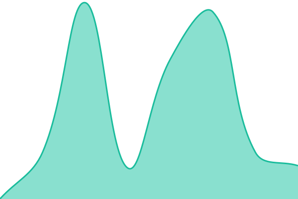
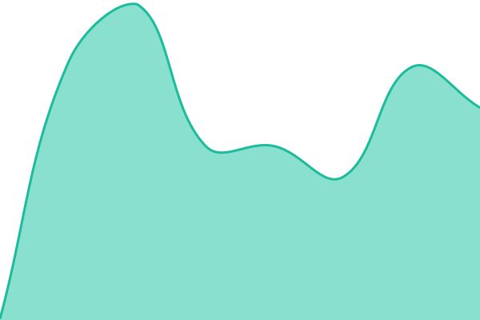

# [📈 Live Status](https://status.axiom-core-labs.com): <!--live status--> **🟩 All systems operational**

This repository contains the open-source uptime monitor and status page for [axiomcorelabs](https://status.axiom-core-labs.com), powered by [Upptime](https://github.com/upptime/upptime).

With [Upptime](https://upptime.js.org), you can get your own unlimited and free uptime monitor and status page, powered entirely by a GitHub repository. We use [Issues](https://github.com/axiomcorelabs/acl-upptime/issues) as incident reports, [Actions](https://github.com/axiomcorelabs/acl-upptime/actions) as uptime monitors, and [Pages](https://status.axiom-core-labs.com) for the status page.

<!--start: status pages-->
<!-- This summary is generated by Upptime (https://github.com/upptime/upptime) -->
<!-- Do not edit this manually, your changes will be overwritten -->
<!-- prettier-ignore -->
| URL | Status | History | Response Time | Uptime |
| --- | ------ | ------- | ------------- | ------ |
|  [Axiom Core - Services](https://www.axiom-core-labs.com) | 🟩 Up | [axiom-core-services.yml](https://github.com/axiomcorelabs/acl-upptime/commits/HEAD/history/axiom-core-services.yml) | 

 415ms
     
 | 

<a href="https://status.axiom-core-labs.com/history/axiom-core-services">99.38%</a>
    

|  [Resend API - Email & Form Services](https://api.resend.com/contacts) | 🟩 Up | [resend-api-email-and-form-services.yml](https://github.com/axiomcorelabs/acl-upptime/commits/HEAD/history/resend-api-email-and-form-services.yml) | 

 177ms
     
 | 

<a href="https://status.axiom-core-labs.com/history/resend-api-email-and-form-services">100.00%</a>
    

|  [Public Client - Factory Park](https://factory-park-immobilier.com/) | 🟩 Up | [public-client-factory-park.yml](https://github.com/axiomcorelabs/acl-upptime/commits/HEAD/history/public-client-factory-park.yml) | 

 162ms
     
 | 

<a href="https://status.axiom-core-labs.com/history/public-client-factory-park">100.00%</a>
    

|  [Public Client - Marie Grosset](https://osteopathe-mariegrosset.com/) | 🟩 Up | [public-client-marie-grosset.yml](https://github.com/axiomcorelabs/acl-upptime/commits/HEAD/history/public-client-marie-grosset.yml) | 

 162ms
     
 | 

<a href="https://status.axiom-core-labs.com/history/public-client-marie-grosset">100.00%</a>
    

|  [Public Client - Arthur Lebas Etiopathe](https://www.arthur-lebas-etiopathe.com/) | 🟩 Up | [public-client-arthur-lebas-etiopathe.yml](https://github.com/axiomcorelabs/acl-upptime/commits/HEAD/history/public-client-arthur-lebas-etiopathe.yml) | 

 147ms
     
 | 

<a href="https://status.axiom-core-labs.com/history/public-client-arthur-lebas-etiopathe">100.00%</a>
    

|  [Public Client - Claire Labbe Osteopathe](https://clairelabbeosteopathe.com/) | 🟩 Up | [public-client-claire-labbe-osteopathe.yml](https://github.com/axiomcorelabs/acl-upptime/commits/HEAD/history/public-client-claire-labbe-osteopathe.yml) | 

 221ms
     
 | 

<a href="https://status.axiom-core-labs.com/history/public-client-claire-labbe-osteopathe">100.00%</a>
    

|  Private Client - 15A1D79 | 🟩 Up | [private-client-15-a1-d79.yml](https://github.com/axiomcorelabs/acl-upptime/commits/HEAD/history/private-client-15-a1-d79.yml) | 

 115ms
     
 | 

<a href="https://status.axiom-core-labs.com/history/private-client-15-a1-d79">99.57%</a>
    

<!--end: status pages-->

[**Visit our status website →**](https://status.axiom-core-labs.com)

## 📄 License

- Powered by: [Upptime](https://github.com/upptime/upptime)
- Code: [MIT](./LICENSE) © [Anand Chowdhary](https://anandchowdhary.com)
- Data in the `./history` directory: [Open Database License](https://opendatacommons.org/licenses/odbl/1-0/)
